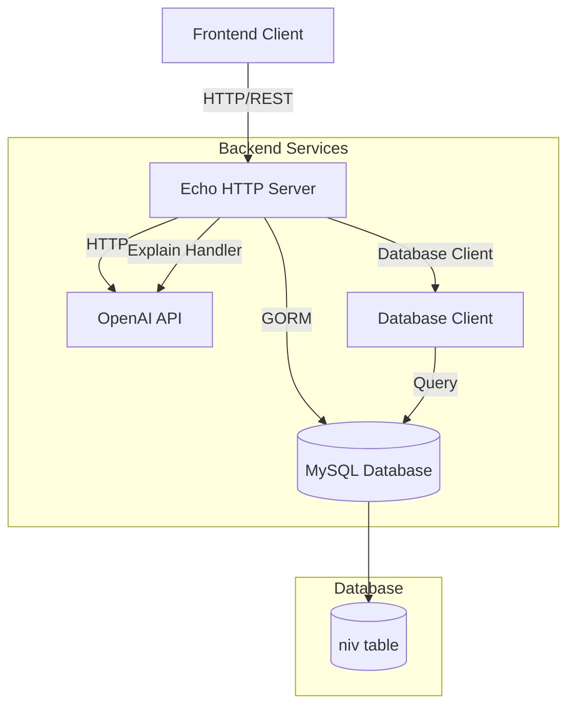

# Bible Reading Backend - Architecture Documentation

## High-Level Architecture



## Services and Components

### Main Application (`main.go`)
- **Responsibility**: Application entry point
- **Functions**:
  - Initializes database client
  - Creates and starts Echo HTTP server
  - Handles application lifecycle

### HTTP Server (`server/server.go`)
- **Responsibility**: HTTP request handling and routing
- **Components**:
  - Echo framework server
  - CORS middleware configuration
  - Route registration
  - Health check endpoints (readiness/liveness)

### Database Client (`database/client.go`)
- **Responsibility**: Database connection and query abstraction
- **Components**:
  - GORM database connection
  - DatabaseClient interface
  - Connection health checking
  - Query methods for verses, books, chapters

### NIV Service (`server/niv_server.go`)
- **Responsibility**: Business logic for Bible verse operations
- **Functions**:
  - Verse retrieval
  - Book and chapter listing
  - Verse explanation via OpenAI integration

## Database Schema

### Table: `niv`

Bible verses table storing New International Version (NIV) text.

| Column | Type | Constraints | Description |
|--------|------|-------------|-------------|
| `book_id` | INT | PRIMARY KEY | Unique identifier for the book |
| `book` | VARCHAR(255) | NOT NULL | Book name (e.g., "Genesis", "Matthew") |
| `chapter` | INT | PRIMARY KEY | Chapter number |
| `verse` | INT | PRIMARY KEY | Verse number |
| `text` | VARCHAR(1000) | NOT NULL | Verse text content |

**Primary Key**: Composite key (`book_id`, `chapter`, `verse`)

**Indexes**:
- Composite primary key index on (`book_id`, `chapter`, `verse`)
- Consider adding index on `book_id` for faster book queries
- Consider adding index on (`book_id`, `chapter`) for chapter queries

**Relationships**:
- No foreign key relationships (standalone table)

## API Endpoints

### Health Check Endpoints

#### GET `/readiness`
Health check endpoint for readiness probe.

**Response** (200 OK):
```json
{
  "status": "OK"
}
```

**Response** (500 Internal Server Error):
```json
{
  "status": "Failure"
}
```

#### GET `/liveness`
Health check endpoint for liveness probe.

**Response** (200 OK):
```json
{
  "status": "OK"
}
```

### NIV Bible Verses Endpoints

#### GET `/api/niv/verses`
Get all verses from the database.

**Response** (200 OK):
```json
[
  {
    "book_id": 1,
    "book": "Genesis",
    "chapter": 1,
    "verse": 1,
    "text": "In the beginning God created the heavens and the earth."
  },
  ...
]
```

**Status Codes**:
- `200 OK`: Success
- `500 Internal Server Error`: Database error

#### GET `/api/niv/:book/:chapter/verses`
Get all verses for a specific book and chapter.

**Path Parameters**:
- `book` (string): Book ID or abbreviation
- `chapter` (integer): Chapter number

**Example Request**:
```
GET /api/niv/Gen/1/verses
```

**Response** (200 OK):
```json
[
  {
    "book_id": 1,
    "book": "Genesis",
    "chapter": 1,
    "verse": 1,
    "text": "In the beginning God created the heavens and the earth."
  },
  {
    "book_id": 1,
    "book": "Genesis",
    "chapter": 1,
    "verse": 2,
    "text": "Now the earth was formless and empty..."
  }
]
```

**Status Codes**:
- `200 OK`: Success
- `400 Bad Request`: Invalid chapter number
- `500 Internal Server Error`: Database error

#### GET `/api/niv/books`
Get all books in the Bible.

**Response** (200 OK):
```json
[
  {
    "book_id": 1,
    "book": "Genesis"
  },
  {
    "book_id": 2,
    "book": "Exodus"
  },
  ...
]
```

**Status Codes**:
- `200 OK`: Success
- `500 Internal Server Error`: Database error

#### GET `/api/niv/chapters/:book`
Get the maximum chapter number for a specific book.

**Path Parameters**:
- `book` (string): Book ID or abbreviation

**Example Request**:
```
GET /api/niv/chapters/Gen
```

**Response** (200 OK):
```json
{
  "maxChapter": 50
}
```

**Status Codes**:
- `200 OK`: Success
- `500 Internal Server Error`: Database error

#### POST `/api/niv/explain`
Get AI-generated explanation for a verse range.

**Request Body**:
```json
{
  "book": "Gen",
  "chapter": 1,
  "start_verse": 1,
  "end_verse": 3,
  "age": 25,
  "belief": 3
}
```

**Request Body Fields**:
- `book` (string, required): Book abbreviation (e.g., "Gen", "Matt")
- `chapter` (integer, required): Chapter number
- `start_verse` (integer, required): Starting verse number
- `end_verse` (integer, required): Ending verse number
- `age` (integer, optional): User age (defaults to 25)
- `belief` (integer, optional): Belief level 1-5 (defaults to 3)

**Response** (200 OK):
```json
{
  "explanation": "These verses describe the creation of the heavens and the earth..."
}
```

**Response** (400 Bad Request):
```json
{
  "error": "Invalid request parameters"
}
```

**Response** (500 Internal Server Error):
```json
{
  "error": "Failed to get explanation"
}
```

**Status Codes**:
- `200 OK`: Success
- `400 Bad Request`: Invalid request parameters
- `500 Internal Server Error`: OpenAI API error, missing API key, or other internal error

## Environment Variables

### Required Variables

| Variable | Description | Example |
|----------|-------------|---------|
| `DB_DSN` | MySQL database connection string | `user:password@tcp(localhost:3306)/bible_reading_db` |

**DB_DSN Format**:
```
username:password@tcp(host:port)/database_name
```

### Optional Variables

| Variable | Description | Example |
|----------|-------------|---------|
| `OPENAI_API_KEY` | OpenAI API key for verse explanations | `sk-proj-...` |

**Note**: `OPENAI_API_KEY` is required for the `/api/niv/explain` endpoint to function.

### Environment File Example

Create a `.env` file in the project root:

```env
DB_DSN=user:password@tcp(localhost:3306)/bible_reading_db
OPENAI_API_KEY=sk-proj-your-api-key-here
```

## Deployment

### Dockerfile

The application uses a multi-stage Docker build:

**Stage 1 - Builder**:
- Base: `golang:1.23-alpine`
- Installs build dependencies
- Downloads Go modules
- Compiles application binary

**Stage 2 - Runtime**:
- Base: `alpine:3.18`
- Copies compiled binary
- Runs as non-root user (`app`)
- Exposes port 8080
- Sets timezone to UTC

**Build Command**:
```bash
docker build -t bible-backend .
```

**Run Command**:
```bash
docker run -d \
  --name bible-backend \
  --network host \
  --env-file .env \
  -p 8000:8000 \
  bible-backend:latest
```

**Note**: The server listens on port 8000 internally, but Dockerfile exposes 8080. Use port mapping `-p 8000:8000` to map container port to host.

### Docker Compose (Optional)

Create `docker-compose.yml`:

```yaml
version: '3.8'

services:
  backend:
    build:
      context: .
      dockerfile: Dockerfile
    container_name: bible-backend
    ports:
      - "8000:8000"
    env_file:
      - .env
    networks:
      - bible-network
    restart: unless-stopped
    healthcheck:
      test: ["CMD", "wget", "--quiet", "--tries=1", "--spider", "http://localhost:8000/liveness"]
      interval: 30s
      timeout: 10s
      retries: 3

networks:
  bible-network:
    driver: bridge
```

### Ports

- **Application Port**: 8000 (internal)
- **Docker Exposed Port**: 8080 (configurable via Dockerfile)

### Deployment Notes

1. **Database Connection**: 
   - For Docker containers, use `localhost` or `host.docker.internal` depending on network mode
   - With `--network host`, use `localhost`
   - With bridge network, use `host.docker.internal` or container name

2. **Network Mode**:
   - Use `--network host` for simpler networking (recommended for production)
   - Allows direct access to host network services

3. **Environment Variables**:
   - Always use `--env-file` to load environment variables
   - Ensure `.env` file has correct permissions
   - Do not commit `.env` file to version control

4. **Health Checks**:
   - Use `/readiness` for readiness probes
   - Use `/liveness` for liveness probes
   - Configure appropriate intervals in orchestration platform

## Security and Authentication

### Current Implementation

**Authentication**: Not implemented in backend
- Frontend sends `Authorization: Bearer <token>` headers
- Backend accepts but does not validate JWT tokens
- All endpoints are currently publicly accessible

**CORS Configuration**:
- Allowed Origins:
  - `http://13.203.234.131:3000` (production frontend)
  - `http://localhost:3000` (development)
- Allowed Methods: GET, POST, PUT, DELETE, OPTIONS
- Allowed Headers: Origin, Content-Type, Accept, Authorization
- Credentials: Allowed

### Security Recommendations

1. **JWT Authentication**:
   - Implement JWT token validation middleware
   - Validate token signature and expiration
   - Extract user information from token claims

2. **Rate Limiting**:
   - Implement rate limiting for API endpoints
   - Especially important for `/api/niv/explain` (OpenAI API costs)
   - Recommended: 100 requests/minute per IP

3. **Input Validation**:
   - Validate all input parameters
   - Sanitize user inputs
   - Prevent SQL injection (GORM handles this, but validate inputs)

4. **API Key Security**:
   - Store `OPENAI_API_KEY` securely
   - Use secrets management (e.g., AWS Secrets Manager, HashiCorp Vault)
   - Never expose in logs or error messages

5. **HTTPS**:
   - Use HTTPS in production
   - Configure TLS certificates
   - Redirect HTTP to HTTPS

6. **CORS**:
   - Restrict CORS origins to known frontend domains
   - Remove wildcard origins
   - Configure per environment

### Future Authentication Implementation

If implementing JWT authentication:

1. **Middleware**:
```go
func JWTAuthMiddleware() echo.MiddlewareFunc {
    return middleware.JWTWithConfig(middleware.JWTConfig{
        SigningKey: []byte(os.Getenv("JWT_SECRET")),
        TokenLookup: "header:Authorization",
    })
}
```

2. **Protected Routes**:
```go
nivServerGroup.Use(JWTAuthMiddleware())
nivServerGroup.POST("/explain", s.ExpainVerse)
```

3. **Token Validation**:
   - Validate token signature
   - Check expiration
   - Verify user permissions/roles if needed

## Technology Stack

- **Language**: Go 1.23
- **Framework**: Echo v4
- **ORM**: GORM v1.31
- **Database**: MySQL 8.0+
- **External APIs**: OpenAI API (GPT-4o-mini)
- **Container**: Docker (Alpine Linux)

## Dependencies

Key dependencies from `go.mod`:
- `github.com/labstack/echo/v4`: HTTP web framework
- `gorm.io/gorm`: ORM library
- `gorm.io/driver/mysql`: MySQL driver for GORM
- `github.com/joho/godotenv`: Environment variable loading
- `golang.org/x/net`: Network utilities

